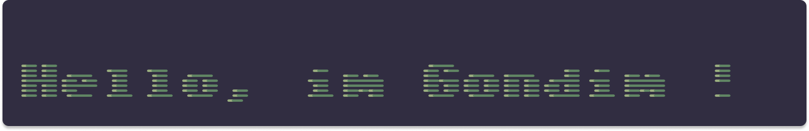

  

## 👨‍💻 About Me

I'm a Software Engineering student at the University of Brasília (UnB), focused on Data Science and Artificial Intelligence. My main interests include machine learning, statistical analysis, and data visualization, applying data-driven approaches to solve practical problems and support decision-making.

Currently, I'm expanding my knowledge of predictive modeling, data analysis, and AI techniques while strengthening the software engineering foundations needed to build reliable and scalable solutions. My approach combines strong software engineering practices with data-driven thinking to create reliable and scalable systems.

## 🛠️ Languages & Tools

  
  
  
  
  
  
  
  
  
  

## 📊 GitHub Stats

  
  

  

